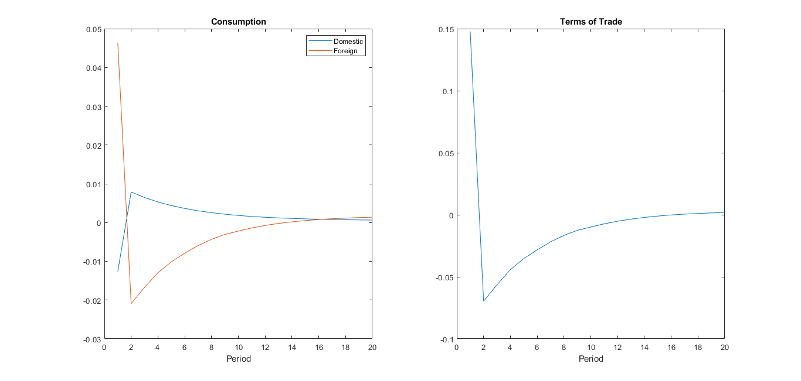
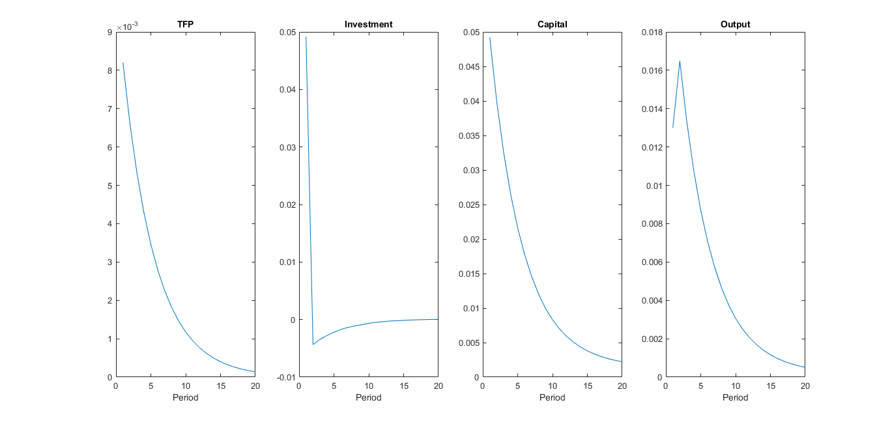

# Trade in a Two-Country, Two-Good SOE Model with Incomplete Financial Markets

Final project for the **Macroeconomics II** course, Master in Economics. The project builds and simulates a two-country, two-good open-economy DSGE model in **Dynare/MATLAB** to study how a productivity shock in one country spills over to its trading partner when international asset markets are incomplete.

## The model

Two symmetric countries, **Home (H)** and **Foreign (F)**, each produce a single good using capital and country-specific TFP (Cobb-Douglas technology). Households in each country consume both goods, with home bias in preferences (`thet` for H, `mu` for F), and accumulate capital subject to standard investment dynamics.

Because there is no complete set of state-contingent assets, each country can only trade a one-period non-contingent bond. To pin down a well-defined steady state and stationary dynamics despite this incomplete-markets friction, the model uses a **debt-elastic interest-rate premium** (Schmitt-Grohé & Uribe, 2003; in the spirit of Mendoza, 1991): the interest rate a country faces rises with its own debt relative to a target level (`dbar`). This is the "elastic R" in the file names.

TFP in each country follows an AR(1) process and is hit with an i.i.d. shock. The model is solved with a **2nd-order perturbation** in Dynare and simulated to trace the transmission of a domestic TFP shock to consumption, output, investment, the terms of trade, the trade balance, foreign debt and the interest-rate/risk premium in both countries.

Full derivation, calibration and discussion of results are in [`Final Project.pdf`](./Final%20Project.pdf).

## Repository structure

| File | Description |
|---|---|
| [`IntSpillovElstcR1.mod`](./IntSpillovElstcR1.mod) | Dynare model file: variable and parameter declarations, equilibrium conditions (Euler equations, resource constraints, production functions, debt-elastic interest rate, market clearing), initial values, shock variances, and the `stoch_simul` call. |
| [`RunIntSpillovElstcR1.m`](./RunIntSpillovElstcR1.m) | MATLAB driver: calls Dynare on the `.mod` file and plots the impulse responses (consumption & terms of trade; TFP, investment, capital & output; trade balance, foreign debt & risk premium). |
| [`SteadyState1.m`](./SteadyState1.m) | Auxiliary script that computes the analytical (non-stochastic) steady state used to calibrate the initial values in the `.mod` file, and the parameter values taken from the literature (Schmitt-Grohé & Uribe, Mendoza). |
| [`Initial SS values.xlsx`](./Initial%20SS%20values.xlsx) | Working spreadsheet used to cross-check the steady-state calibration. |
| [`Figures/`](./Figures) | Selected impulse-response plots from the simulation (see below). |
| [`Final Project.pdf`](./Final%20Project.pdf) | Full write-up: model setup, calibration, and discussion of the international spillover results. |

## Selected results

Impulse responses to a one-standard-deviation domestic TFP shock (`e1`):

**Consumption and terms of trade**

**TFP, investment, capital and output (domestic country)**

**Trade balance, foreign debt and risk premium**

A positive TFP shock at home raises domestic output, investment and capital, while consumption rises abroad more than at home on impact (international risk-sharing through the terms of trade) before both converge back to steady state. The trade balance and the debt-elastic risk premium move to gradually pull external debt back toward its target level.

## Running the model

Requirements:
- [MATLAB](https://www.mathworks.com/)
- [Dynare](https://www.dynare.org/) (developed against 4.6.3)

Steps:
1. Install Dynare and add it to your MATLAB path (edit the `addpath` line at the top of `RunIntSpillovElstcR1.m` to point to your local Dynare `matlab` folder).
2. Open MATLAB in this folder.
3. Run `RunIntSpillovElstcR1.m`. It calls Dynare on `IntSpillovElstcR1.mod`, solves and simulates the model, then produces the impulse-response figures above from `oo_.irfs`.

## References

- Mendoza, E. G. (1991). *Real Business Cycles in a Small Open Economy*. American Economic Review.
- Schmitt-Grohé, S. and Uribe, M. (2003). *Closing Small Open Economy Models*. Journal of International Economics.

---
Shared for portfolio purposes as part of a Master in Economics coursework project.
